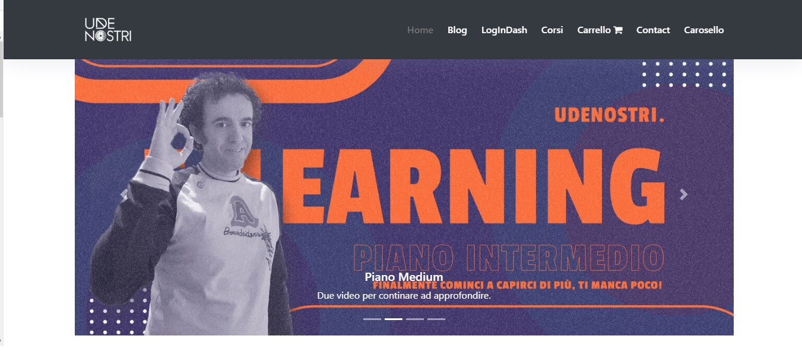
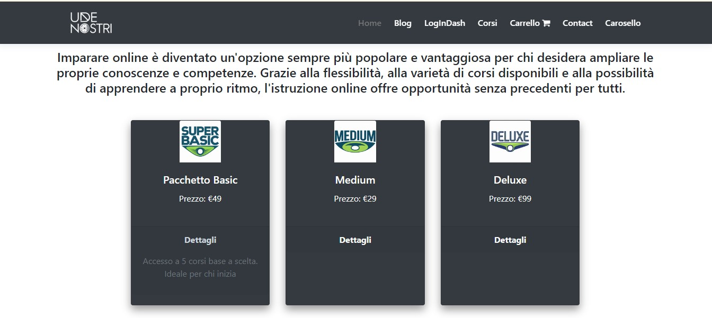
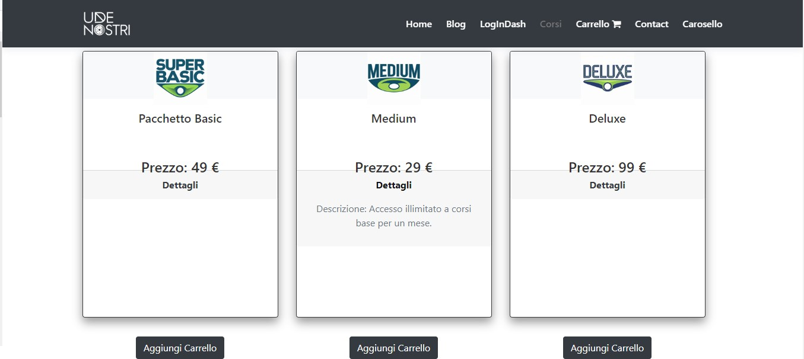
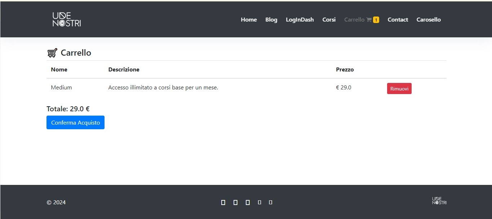
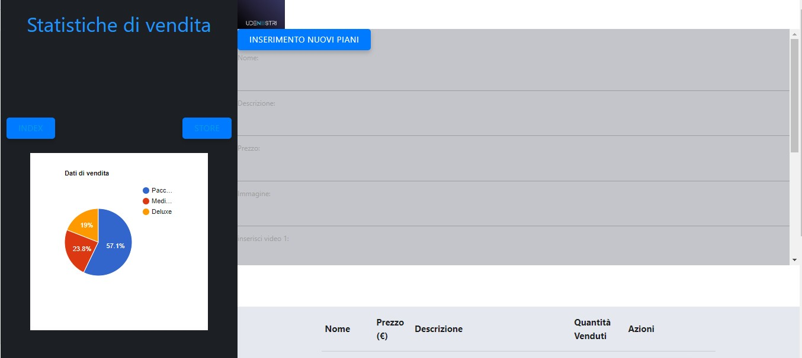

# Video Learning Courses

 <!-- Logo or main image of the project -->

## Project Overview

The **Video Learning Courses** project is a web application built with **Spring Boot**. It allows users to purchase subscription plans for video courses. The app features a shopping cart system, an email confirmation process for purchases, and an admin dashboard to manage the available plans and view sales statistics.

## Technologies Used

- **Spring Boot** - For creating the backend and managing the entire application lifecycle.
- **JDBC** - For handling the connection and queries to the MySQL database.
- **Thymeleaf** - For dynamic HTML templating.
- **Bootstrap** - For responsive and modern frontend design.
- **MySQL** - For managing the data related to the subscription plans and orders.
- **Google Charts** - For displaying sales statistics with pie charts.
- **Email Service** - For sending email confirmations to users after purchase.

## Features

### Index Page
The homepage features a **carousel of images** and several **cards** showcasing different available subscription plans. The plans are categorized into **Basic**, **Medium**, and **Deluxe** tiers.

### Store Section (Courses)
In the **Courses** section, users can purchase one or more plans. When a plan is added to the cart, the quantity is dynamically updated in the **navbar**.

### Shopping Cart and Purchase Confirmation
Once the user has selected the plans they wish to purchase, they can proceed to the **purchase confirmation** page. Here, users can enter their **email address** to receive a purchase confirmation email.

### Admin Dashboard - Plan Management
Administrators have access to the **dashboard** where they can add new subscription plans, each with up to 4 videos. Plans can also be **deleted** in this section.

### Sales Statistics
The dashboard includes a **pie chart** that uses **Google Charts** to display the sales percentages of each plan. The statistics automatically update based on the orders placed.

.jpg)

## Database Structure
The project uses a **MySQL** database to manage the information related to the subscription plans and orders. Each plan includes a name, description, price, image, and up to 4 videos.

.jpg)

---

### Footer

&copy; 2024 Video Learning Courses. Giuseppe Denora All rights reserved.
